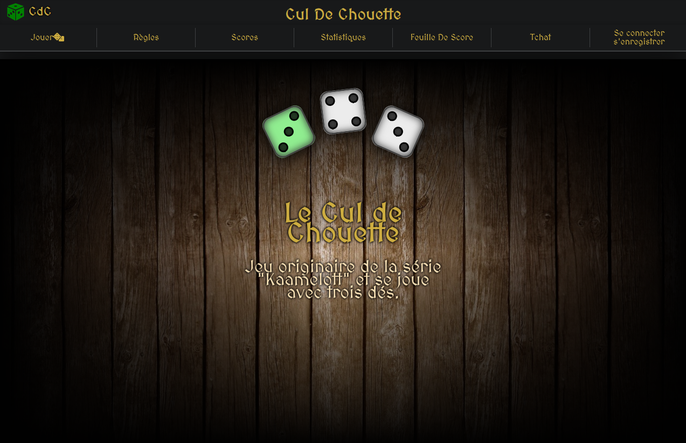
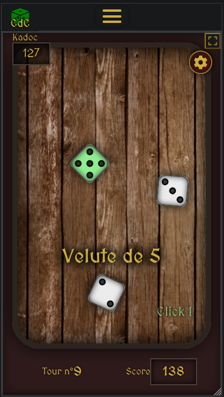

# Cul de Chouette
Application complète autour du jeu de dés *Cul de Chouette* (règles communautaires popularisées par la série *Kaamelott*) : accueil et articles administrables, page des règles, comptes joueurs, classement (façon borne d'arcade) avec statistiques par joueur connecté, et le jeu lui-même, avec lancers en deux temps, détection automatique des figures, mode entraînement ou adversaires scriptés.
Les règles du jeu proviennent du [**wiki**](http://plus.wikimonde.com/wiki/Cul_de_chouette).

🎲 [**Jouer en ligne**](https://pat-mulot.com/games/wpcdc/public/game/)  
🎲 [**Accès à la feuille de score**](https://pat-mulot.com/games/wpcdc/public/feuille-de-score)  
🎲 [**Accès à l'app**](https://pat-mulot.com/games/wpcdc/public/)  

*Premier projet "jour 2" en sortie de formation, ma première application fullstack (frontend + backend, contenu administrable), après plusieurs jeux front qui m'avaient surtout servi à apprendre le JS/l'algo.*

## Aperçu

## Côté technique
Backend WordPress avec un thème et un plugin maison (routes et API custom, plusieurs types de contenus dédiés : joueurs, scores, statistiques...) pour gérer comptes, classement et persistance des données de jeu.

Côté jeu : logique de lancés, détection des figures et scoring géré en JavaScript vanilla, avec des adversaires scriptés aux comportements différenciés (vitesse, prise de risque, aléa).

Le projet contient aussi une ébauche de chat en temps réel (Node.js + WebSocket) : une première brique posée à l'époque en vue d'un mode multijoueur, restée au stade de simple messagerie. Désactivée et non maintenue.

**Stack** : WordPress/PHP, JavaScript Vanilla, Node.js (WebSocket)
